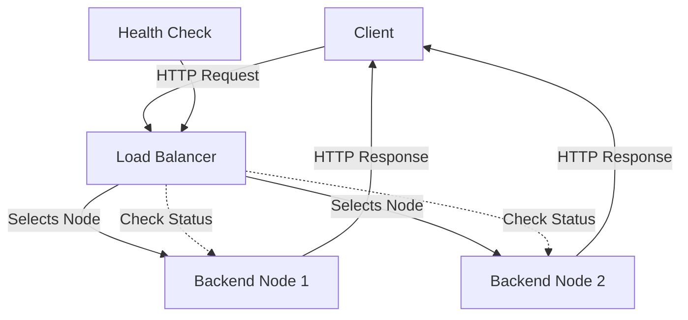

# Load Balancer - README

This repository contains a Go-based Load Balancer implementation designed to distribute incoming HTTP requests across multiple backend servers (nodes). The Load Balancer uses a combination of Round Robin and weighted selection with a heap to ensure efficient load distribution and reliability through health checks.

## Table of Contents
- [Load Balancer - README](#load-balancer---readme)
  - [Table of Contents](#table-of-contents)
  - [Features](#features)
  - [How It Works](#how-it-works)
  - [Installation](#installation)
  - [Usage](#usage)
  - [Load Balancing Strategies](#load-balancing-strategies)
    - [Round Robin](#round-robin)
    - [Example](#example)
    - [Heapify and Weighted Selection](#heapify-and-weighted-selection)
      - [How Heapify Works](#how-heapify-works)
      - [Example](#example-1)
  - [Health Checks](#health-checks)
    - [Example](#example-2)
  - [Example Diagram](#example-diagram)
    - [System Flow](#system-flow)
- [Node Selection and Heap Example](#node-selection-and-heap-example)
  - [Before Health Check](#before-health-check)
    - [Heap](#heap)
- [Node State After Health Check](#node-state-after-health-check)
  - [Node Status](#node-status)
  - [Updated Heap](#updated-heap)
- [Exaplaination](#exaplaination)
- [License](#license)

## Features
- **Round Robin and Weighted Selection**: Balances the load across available nodes using a hybrid approach.
- **Health Checks**: Regularly verifies the status of nodes and adjusts their weights accordingly.
- **Dynamic Node Management**: Allows adding or removing nodes on the fly.
- **Retry Mechanism**: Retries requests a specified number of times before marking a node as inactive.

## How It Works
1. **Node Pool**: The Load Balancer maintains a pool of backend servers (nodes), each with a URL, an active status, and a weight that influences the selection process.
2. **Request Routing**: Incoming requests are routed to the next available node based on a weighted selection algorithm. The weight reflects the node's reliability and capacity.
3. **Health Checks**: Nodes are periodically checked for availability, and their weights and statuses are updated based on the results.
4. **Retries and Failover**: If a request to a node fails, the Load Balancer retries the request with the same or another node up to three times before marking the node as inactive.

## Installation
1. Clone the repository:
    ```bash
    > git clone https://github.com/sanjay-sol/Load_Balancer.git
    > cd Load_Balancer
    ```
2. Install dependencies:
    ```bash
    > go mod tidy
    ```

## Usage
1. **Start the Load Balancer**:
    ```bash
    > go run cmd/main.go -nodeList=http://backend1.com,http://backend2.com -port=3030
    ```
   Replace `http://backend1.com` and `http://backend2.com` with your backend server URLs. The `port` flag specifies the port for the Load Balancer.
    - Example ( Start the simple test servers -- express/any on ports 8081,8082,8083)
    ```bash
     > go run cmd/main.go -nodeList=http://localhost:8081,http://localhost:8082,http://localhost:8083 -port=3030
   ```


2. **Accessing the Load Balancer**:
   Once started, the Load Balancer listens for incoming HTTP requests on the specified port and routes them to the backend servers.

   ```bash
   > curl http://localhost:3030
   ```
   see the Requests sent to different servers automatically each time

## Load Balancing Strategies

### Round Robin
The Round Robin method is a straightforward and popular load balancing technique. It distributes client requests in a circular order, ensuring that each node receives an equal share of the load. Here's how it works:

1. **Initial State**:
   - Nodes: A, B, C
   - Current Node: A

2. **Request Sequence**:
   - 1st Request: Node A
   - 2nd Request: Node B
   - 3rd Request: Node C
   - 4th Request: Node A (cycle repeats)

### Example
- Nodes: `A`, `B`, `C`
- Incoming Requests: 5

| Request | Node |
|---------|------|
| 1       | A    |
| 2       | B    |
| 3       | C    |
| 4       | A    |
| 5       | B    |

In this example, Node A receives the 1st and 4th requests, Node B receives the 2nd and 5th, and Node C receives the 3rd request.

### Heapify and Weighted Selection
Heapify is a process that arranges nodes into a binary heap based on their weights, ensuring that nodes with higher weights are given priority. The Load Balancer uses a max-heap structure where the root node has the highest weight, making it the preferred choice for the next request.

#### How Heapify Works
1. **Initial Heap**:
   - Nodes: `[Node 1 (weight: 1.0), Node 2 (weight: 0.5), Node 3 (weight: 0.8)]`

2. **Heapify Process**:
   - Compare the weights of the nodes.
   - Swap nodes to ensure the largest weight is at the root.

3. **Resulting Heap**:
   - Nodes: `[Node 1 (weight: 1.0), Node 3 (weight: 0.8), Node 2 (weight: 0.5)]`

#### Example
- Nodes: `A (weight: 1.0)`, `B (weight: 0.5)`, `C (weight: 0.8)`

| Step | Action                       | Heap Order            |
|------|------------------------------|-----------------------|
| 1    | Initialize heap              | A (1.0), B (0.5), C (0.8) |
| 2    | Compare A and C              | A (1.0), B (0.5), C (0.8) |
| 3    | C > B, swap B and C          | A (1.0), C (0.8), B (0.5) |
| 4    | A is root (no changes needed)| A (1.0), C (0.8), B (0.5) |

In this example, Node A remains at the top due to its highest weight, followed by Node C and then Node B.

## Health Checks
The Load Balancer performs periodic health checks on each node to ensure they are active and capable of handling requests. Nodes that fail the health check are marked as inactive and their weights are adjusted to minimize or eliminate their use in routing decisions.

### Example
1. **Initial State**:
   - Nodes: `[Node 1 (weight: 1.0, active), Node 2 (weight: 1.0, active)]`

2. **Health Check**:
   - Node 1: Successful
   - Node 2: Unsuccessful

3. **Updated State**:
   - Nodes: `[Node 1 (weight: 1.0, active), Node 2 (weight: 0.33, inactive)]`

In this scenario, Node 2's weight is reduced, making it less likely to be chosen for future requests.

## Example Diagram

### System Flow



# Node Selection and Heap Example

## Before Health Check

| Node   | Initial Weight | Status |
|--------|----------------|--------|
| Node A | 1.0            | Active |
| Node B | 1.0            | Active |
| Node C | 0.8            | Active |

### Heap

```yaml
Node A: Weight 1.0
Node B: Weight 1.0
Node C: Weight 0.8

```

# Node State After Health Check

## Node Status

After performing a health check, the status and weights of the nodes are updated as follows:

| Node   | Updated Weight | Status   |
|--------|----------------|----------|
| Node A | 1.0            | Active   |
| Node B | 0.33           | Inactive |
| Node C | 0.8            | Active   |

## Updated Heap

The nodes are arranged in a heap based on their updated weights. The heap helps in efficiently selecting the next node for handling incoming requests, giving priority to nodes with higher weights.

```yaml
Node A: Weight 1.0
Node C: Weight 0.8
Node B: Weight 0.33

```

# Exaplaination

- Node A: With a weight of 1.0 and active status, Node A remains at the top of the heap, indicating its readiness to handle requests.
- Node C: Node C, with a weight of 0.8, is the next preferred node due to its relatively high weight and active status.
- Node B: Node B has the lowest weight of 0.33 and is currently inactive. It is placed at the bottom of the heap, reflecting its reduced priority for handling requests.

# License

- [MIT License](LICENSE)